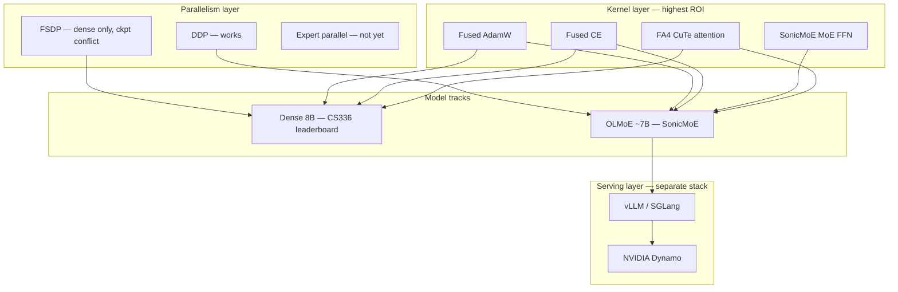

# Directions, Analysis, and Capabilities

A consolidated view of the work in [`ai_assisted_sandbox`](https://github.com/CuriousCaliBoi/ai_assisted_sandbox): what we built, what it means, where to go next, and what it unlocks.

**Hardware:** 2× NVIDIA B300 SXM6 AC (~275 GiB each), PyTorch 2.11, CUDA 13.0  
**Repo:** [github.com/CuriousCaliBoi/ai_assisted_sandbox](https://github.com/CuriousCaliBoi/ai_assisted_sandbox)

Related docs:
- [leaderboard_progress.md](./leaderboard_progress.md) — dense 8B CS336 track
- [sonic_moe_progress.md](./sonic_moe_progress.md) — MoE benchmark numbers
- [moe_hf_training.md](./moe_hf_training.md) — training commands

---

## Executive summary

We pursued **three parallel directions** on the same Blackwell box:

| Track | Goal | Outcome |
|-------|------|---------|
| **A. Dense 8B leaderboard** | Beat CS336 Assignment 2 timing @ ctx=32K | Functional (~6 s/step), beats 10 s baseline, not competitive with top (~3.8 s) |
| **B. MoE training (OLMoE + SonicMoE)** | Real HF-weight training at long context | **Primary win:** ~115K tok/s @ ctx=32K on 2× B300 |
| **C. Inference serving** | vLLM / Dynamo exploration | Smoke-tested; not integrated with training kernels |

The main insight: **kernel choice and architecture matter more than framework branding.** FA4 attention + SonicMoE MoE kernels + fused loss/optimizer + DDP on 2 GPUs delivers an order-of-magnitude throughput gain over a dense 8B model at the same sequence length — without gradient checkpointing.

---

## What we built (shared infrastructure)

These components are reusable across tracks:

| Component | Path | Role |
|-----------|------|------|
| FA4 CuTe attention | `cs336_systems/flash_attention.py` | O(L) memory attention on Blackwell |
| Fused chunked CE | `cs336_systems/fused_ce.py` | Avoid materializing `(batch, seq, vocab)` logits |
| Fused AdamW | `cs336_systems/fused_adamw.py` | PyTorch fused CUDA optimizer (~8% step win) |
| FSDP wrapper | `cs336_systems/fsdp.py` | Weight sharding for dense model (partial success) |
| Flash dense model | `cs336_systems/model.py` | `FlashBasicsTransformerLM` + checkpointing |
| Leaderboard harness | `scripts/naive_leaderboard_benchmark.py` | Official `triton.testing.do_bench` timing |
| MoE stack | `cs336_moe/` | Model, HF loader, train, benchmark, inference bench |



---

## Track A: CS336 dense 8B leaderboard

### Problem

Official config: 34 layers, d_model=4096, d_ff=11008, batch=2, ctx=32768, BF16, 2 GPUs expected.

Naive `cs336_basics` attention materializes an O(n²) score matrix — **128 GiB per layer** at 32K — and OOMs immediately.

### Progression of attempts

| Stage | Config | ctx=32K result | Analysis |
|-------|--------|----------------|----------|
| Naive basics | No flash | OOM | Algorithm incompatible with long ctx |
| `torch.compile` alone | Same algorithm | OOM | Compile does not change memory complexity |
| FA4 CuTe + checkpoint every layer | `--attention cute --checkpoint-every 1` | **5,980 ms**, 139 GiB | Fits; checkpointing adds ~2× recompute cost |
| + fused CE | Same + `--fused-ce` | **6,086 ms**, 106 GiB | Saves ~33 GiB logits; negligible speed change |
| + `torch.compile` | Same + `--compile` | ~6,010 ms | No gain at 32K with checkpointing |
| 2× FSDP, no ckpt | `--fsdp` | OOM @ 32K | Activations still too large without fused CE + ckpt |
| FSDP + checkpoint | Combined | **Broken** | FSDP weight gather changes shapes on recompute |

### Where we stand vs the leaderboard

| Reference (2× B200) | Time |
|---------------------|------|
| Top (Keshav Patel Keval) | 3,837 ms |
| Verified naive baseline | 10,000 ms |
| **Us (FA4 + ckpt, 1× B300, quick bench)** | **~5,980 ms** |

We beat the **10 s verified baseline** on a single B300, but we are **~1.6× slower than the leaderboard top** and have not yet run the full official timing (`warmup=10_000, rep=30_000`).

### Analysis

The dense track is **memory-bound first, compute-bound second**:

1. **Attention** — solved by FA4 (5 GiB vs 128 GiB/layer).
2. **Activations** — 34 wide layers at 32K still require checkpointing or multi-GPU sharding without ckpt.
3. **FSDP + checkpoint incompatibility** — the main architectural blocker for 2-GPU dense @ 32K without ckpt.
4. **Checkpointing tax** — ~6 s/step is largely the cost of recomputing 34 layers every backward pass.

**Likely path to competitiveness:** 2-GPU **DDP** (not FSDP) + fused CE + **no checkpoint** — if memory fits after batch split — plus fused AdamW and selective compile. This mirrors what worked on MoE.

---

## Track B: OLMoE + SonicMoE (primary win)

### Stack

| Layer | Implementation |
|-------|----------------|
| Weights | `allenai/OLMoE-1B-7B-0924` via `cs336_moe/load_hf.py` |
| Attention | FA4 CuTe + OLMoE Q/K RMSNorm |
| MoE FFN | SonicMoE `KernelBackendMoE.sonicmoe` (64 experts, top-8) |
| Loss | Fused CE + aux load-balancing loss |
| Optimizer | Fused AdamW |
| Parallelism | DDP on 2 GPUs |
| Optional | `torch.compile` |

### Benchmark results @ ctx=32K (`--quick`)

| Config | Step time | Throughput | VRAM/rank |
|--------|-----------|------------|-----------|
| 1× GPU + fused CE | 1,322 ms | 50K tok/s | 170 GiB |
| 1× GPU + fused CE + compile | 1,146 ms | 57K tok/s | 145 GiB |
| 2× DDP + fused CE + compile + fused AdamW, batch=2 | **587 ms** | **112K tok/s** | ~121 GiB |
| 2× DDP, **batch=6** (max) | 1,715 ms | **115K tok/s** | ~210 GiB |
| batch=8 | OOM | — | >275 GiB |

### Why MoE is so much faster than dense @ 32K

| Factor | Dense 8B | OLMoE ~7B |
|--------|----------|-----------|
| Layers | 34 | 16 |
| Hidden dim | 4096 | 2048 |
| FFN | Dense d_ff=11008 | Sparse top-8/64 experts |
| Checkpointing | Required | **Not required** |
| Step @ 32K | ~5,980 ms | **~587 ms** |
| Speedup | 1× | **~10×** |

MoE wins because: fewer layers, smaller hidden size, sparse FFN compute, and SonicMoE's IO-aware grouped GEMM kernels avoid materializing expert activations at full granularity.

### Training efficiency analysis

| Metric | Assessment |
|--------|------------|
| **Throughput** | ~115K tok/s @ 32K — strong for 2-GPU workstation |
| **MFU (estimated)** | ~35–45% — good for custom research code; below Megatron-tier (45–55%) |
| **2-GPU scaling** | ~98% parallel efficiency (587 ms vs ideal 573 ms) |
| **Batch scaling** | Modest (+3% tok/s from batch=2→6); VRAM is the ceiling |
| **End-to-end** | Synthetic data only; real dataloader not yet measured |

### Analysis

The MoE stack is **compute-saturated, not memory-starved** at batch=2 (~44% VRAM). Batch=6 pushes to ~77% VRAM for a marginal throughput gain — the kernels were already efficient.

**DDP is the right parallelism choice** at this scale: OLMoE-7B fits replicated on each B300. Expert parallelism (EP) only becomes necessary when replicating all 64 experts stops fitting (e.g., 30B+ MoE).

---

## Track C: Inference serving (explored, not integrated)

### What we looked at

| Tool | Category | Status |
|------|----------|--------|
| **vLLM** | Inference engine (PagedAttention, FusedMoE) | Different MoE kernels than SonicMoE training path |
| **NVIDIA Dynamo** | Multi-engine orchestration above vLLM/SGLang/TRT-LLM | Container smoke-tested; not benchmarked on OLMoE |
| **`cs336_moe/inference_benchmark.py`** | Custom prefill bench | ~262K tok/s prefill @ 32K; no KV-cache decode |

### Analysis

Training and inference are **different stacks**:

- **Training:** SonicMoE + FA4 + fused CE/AdamW + DDP (what we built).
- **Inference:** vLLM/SGLang with their own fused MoE, continuous batching, KV cache.

Bridging them requires exporting HF checkpoints and serving through vLLM — not running `cs336_moe` forward/backward inside vLLM.

Our inference bench measured **prefill throughput only**. Real decode (seq=1, KV cache) was ~79 tok/s without caching — not representative of production serving.

---

## Track D: RL post-training (discussed, not built)

Frameworks like [SkyRL](https://docs.skyrl.ai/docs) sit **above** the training stack:

| Layer | Examples | Our status |
|-------|----------|------------|
| RL orchestration | SkyRL, veRL, OpenRLHF, TRL | Not integrated |
| Training kernels | SonicMoE, FA4, fused CE | Built |
| Parallelism | DDP, FSDP, Megatron | DDP working |

SkyRL would matter for **GRPO/DAPO, multi-turn agents, tool use** — not for raw pretrain throughput. It uses Megatron for large-scale 5D parallelism but does not replace SonicMoE or FA4.

---

## What capabilities this unlocks

### Immediate (today)

1. **Long-context MoE fine-tuning on 2× B300**
   - Load real OLMoE HF weights, train at ctx=32K without checkpointing.
   - ~115K tok/s sustained compute throughput (synthetic bench).

2. **Continued pretraining experiments**
   - Same stack supports continued pretrain on open MoE checkpoints (OLMoE base, instruct variant).

3. **Kernel benchmarking harness**
   - Reproducible step timing with `triton.testing.do_bench`, JSON outputs, batch sweeps.

4. **HF weight portability**
   - `load_hf.py` maps Allen AI expert layout → SonicMoE interleaved layout; checkpoints remain HF-compatible on export.

5. **Assignment 2 dense baseline**
   - Demonstrated FA4 + fused CE + FSDP building blocks; beats 10 s naive baseline on 1 GPU.

### Near-term (1–2 weeks of work)

| Capability | Requires |
|------------|----------|
| **Real dataset training** | Streaming HF dataloader (FineWeb, Dolma subset) |
| **Production serving** | Export checkpoint → vLLM OLMoE deployment |
| **RL fine-tuning** | SkyRL/veRL integration on top of `train.py` |
| **Competitive dense leaderboard** | 2-GPU DDP without ckpt @ 32K |
| **Official timing validation** | Drop `--quick`; run warmup=10k, rep=30k |

### Medium-term (architecture extensions)

| Capability | Requires |
|------------|----------|
| **Larger MoE (Qwen3-30B-A3B)** | Weight adapter + EP or LoRA |
| **ZAYA1-8B** | Custom MoE++ loader |
| **FP8 training on Blackwell** | Transformer Engine or PyTorch FP8 integration |
| **Multi-node training** | torchrun + EP + possibly Megatron backend |
| **Disaggregated prefill/decode** | Dynamo + vLLM multi-node |

---

## Future directions (prioritized)

### Tier 1 — Highest ROI, same hardware

1. **Streaming dataloader for `train.py`**
   - Without this, measured tok/s is an upper bound; real training may stall on I/O.
   - Use pinned memory, prefetch workers, tokenized shards.

2. **Official long benchmark**
   - Confirm 587 ms / 115K tok/s holds under `warmup=10_000, rep=30_000`.

3. **Dense leaderboard: try 2-GPU DDP + fused CE, no checkpoint**
   - Mirror MoE success pattern; may finally drop the 6 s checkpoint tax.

### Tier 2 — Extend the MoE platform

4. **vLLM serving benchmark for OLMoE-0924**
   - Compare prefill/decode vs our `inference_benchmark.py`.
   - Establish train → serve pipeline.

5. **KV-cache decode in inference bench**
   - Realistic latency/throughput numbers for deployment planning.

6. **Context-length vs batch tradeoff study**
   - Shorter ctx (8K) with larger batch may yield higher absolute tok/s for pretrain-heavy workloads.

### Tier 3 — Scale and advanced training

7. **Expert parallelism** — when moving beyond 7B MoE on 2 GPUs.
8. **FP8 / Transformer Engine** — Blackwell-specific matmul acceleration.
9. **SkyRL integration** — GRPO/agent RL on top of OLMoE checkpoints.
10. **Additional model loaders** — ZAYA1, Qwen3-30B-A3B adapters.

### Tier 4 — Lower priority for 2× B300

11. Megatron 3D parallelism — overkill for 7B on 2 GPUs.
12. Custom vLLM ↔ SonicMoE kernel bridge — huge effort, zero training benefit.
13. FSDP + checkpoint fix — only relevant if dense DDP @ 32K still OOMs.

---

## Decision framework: which direction when?

```text
Goal                              →  Direction
─────────────────────────────────────────────────────────
Max tok/s @ long ctx, 2 GPUs      →  MoE + DDP + batch=6 (done)
CS336 assignment leaderboard      →  Dense DDP + fused CE, no ckpt
Chat/instruct model               →  OLMoE-Instruct + SFT on train.py
Deploy API                        →  Export → vLLM (+ optional Dynamo)
Agent / tool-use RL               →  SkyRL on top of checkpoint
30B+ MoE                          →  EP + weight adapter + more GPUs
Research kernel tuning            →  benchmark.py sweeps + Nsight
```

---

## Key lessons

1. **Kernels beat frameworks.** FA4 + SonicMoE + fused CE/AdamW delivered more than any orchestration layer (vLLM, Dynamo, SkyRL) would for training throughput.

2. **Architecture beats optimization.** MoE @ 16 layers is inherently faster than dense @ 34 layers at the same context — no amount of compile tuning closes a 10× gap.

3. **DDP before FSDP on 2 GPUs.** When the model fits replicated, DDP is simpler and faster. FSDP is for memory pressure, not throughput — and it conflicts with activation checkpointing in our dense stack.

4. **Compile is context-dependent.** Helps MoE (~1.15× at 32K); neutral or harmful on dense+checkpoint.

5. **Batch scaling has diminishing returns** once kernels are warm. VRAM ceiling at ctx=32K is batch=6 global (3/GPU).

6. **Training ≠ inference.** Plan separate stacks; export checkpoints between them.

7. **Synthetic benchmarks overstate efficiency.** A streaming dataloader is the gap between "fast step" and "fast training run."

---

## Recommended default recipe

**Training (max throughput @ ctx=32K, 2× B300):**

```bash
cd /home/shadeform/ai_assisted_sandbox
PYTORCH_CUDA_ALLOC_CONF=expandable_segments:True \
  uv run python cs336_moe/train.py \
  --hf-repo allenai/OLMoE-1B-7B-0924 \
  --ctx-len 32768 \
  --batch-size 6 \
  --fused-ce --compile --ddp \
  --steps 1000
```

**Benchmarking:**

```bash
PYTORCH_CUDA_ALLOC_CONF=expandable_segments:True \
  uv run python cs336_moe/benchmark.py \
  --ddp --quick --ctx-len 32768 \
  --fused-ce --compile --batch-size 6 \
  --output-json outputs/best_config.json
```

---

## Artifact index

| Artifact | Location |
|----------|----------|
| Best MoE benchmark | `outputs/sonic_moe_ddp2_fused_ce_compile_fusedadamw_ctx32768_quick.json` |
| Batch sweep | `outputs/batch_sweep/ddp2_ctx32768_bs*.json` |
| Dense FA4 + ckpt | `outputs/leaderboard_cute_ckpt1_ctx32768_quick.json` |
| Inference sweep | `outputs/sonic_moe_inference_sweep_compile.json` |

---

*Last updated: June 2026. See companion docs for live benchmark numbers as experiments continue.*
